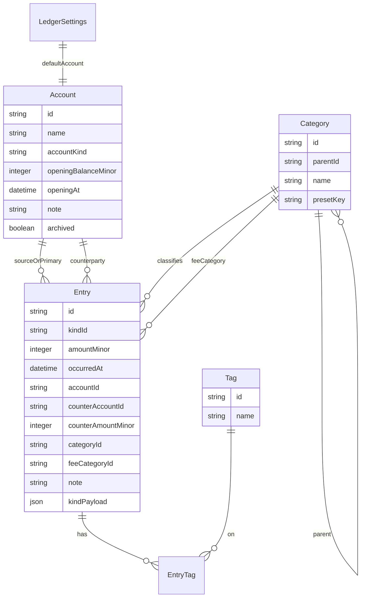

# Domain model

This document is the logical model for the single ledger stored in one SQLite file. Physical column names can follow these fields in `snake_case`. It is not a migration script.

Related: [glossary.md](glossary.md), [entry-kinds.md](entry-kinds.md).

## Why accounts are first-class in v1

Income and expense can be recorded with only categories. **Repayment**, **prepayment**, and **transfer** cannot: they are “money left this account” and, for transfer, “money entered that account.” If v1 has no account, those kinds collapse into notes.

v1 requires an **Account** on every entry (`accountId`). Transfers also require a **counterparty account**. Seed one **Default** account; the user adds, edits (including a **note**), and deletes accounts under the same rules as categories.

v1 repayment and prepayment are **thin**: no liability ledger, no prepaid-asset ledger, no amortization, no reconciliation. Balance is derived.

## Entity map



There is one ledger per database. `LedgerSettings` is a single-row (or key-value) record, not a list of books.

## Identifiers

- Use opaque string ids (UUIDs are fine).
- **Kind ids**, **preset ids**, and **i18n keys** are stable English tokens (`income`, `preset.account.default`). They are never translated in storage.

## Ledger settings

| Field | Role |
|-------|------|
| `currencyCode` | v1 constant `CNY`. Not stored per entry. |
| `defaultAccountId` | Account used when the user does not pick another. Must always point at an existing, non-archived account, or the last remaining account. Transfer destination has no separate default; the UI may remember last destination later (not required). |
| `schemaVersion` | Integer for future migrations. |
| `uiLanguage` | Optional. `en` or `zh-Hans` when the user has chosen a language; null means follow the rule in [i18n.md](i18n.md). |
| `colorScheme` | Optional. `light` \| `dark` \| `system`. Null means `system`. Visual tokens: [ui.md](ui.md). |
| `defaultFeeCategoryId` | Optional subcategory used as the initial `feeCategoryId` on a transfer with a fee. Seeded to Transfer → Transfer fee. Null if the user cleared it or deleted that category after retargeting. |
| `reportMode` | Optional last Reports tab: `week` \| `month` \| `year` \| `custom`. Null → `month`. |
| `reportSide` | Optional last side: `expense` \| `income`. Null → `expense`. |
| `reportCustomFrom` / `reportCustomTo` | Optional local dates for Custom mode. |

Changing currency is out of v1. Do not add `currencyCode` on entries “just in case”; a later multi-currency design will be explicit.

## Account

| Field | Role |
|-------|------|
| `id` | Stable id. |
| `name` | User-visible; user data, not i18n (presets: see [i18n.md](i18n.md)). |
| `accountKind` | Coarse class: `cash`, `bank`, `ewallet`, `credit`, `other`. Extensible string enum, not a second registry as heavy as entry kinds. WeChat / Alipay balances are `ewallet`. |
| `openingBalanceMinor` | Integer minor units. May be zero. |
| `openingAt` | Instant the opening balance refers to. Entries with `occurredAt` at or after this instant apply; document the comparison as **`occurredAt >= openingAt`**. |
| `note` | Optional free text (card number hint, “工资卡”, …). User data; not i18n. |
| `archived` | Optional. Hidden from pickers; historical entries remain. v1 can ship without archive if create/rename/delete is enough. |
| `sortOrder` | Optional, for the picker. |
| `presetKey` | Null for user accounts. For the seeded default, the i18n key. |

Rules:

- Accounts are **user-owned**. The UI lists them from SQLite; do not hardcode WeChat/bank names.
- At least one account always exists. Seed **Default** (`preset.account.default`) on first run; the user may rename it, add others, and delete Default once another account exists and is the default.
- Fields the user can edit: name, `accountKind`, opening balance / `openingAt`, **note**, sort order.
- **Delete** an account only if no entry references it as `accountId` or `counterAccountId`, it is not the sole remaining account, and it is not `defaultAccountId` (assign a new default first). Do not cascade-delete entries.
- A `credit` account is still just a named balance. Paying a credit-card **account** is a `transfer`. Paying a debt that is **not** an account is a `repayment`.

### Derived balance

```
balance(account A) =
  openingBalanceMinor
  + sum(amountMinor
        where kind.balanceEffect = increase and accountId = A)
  - sum(amountMinor
        where kind.balanceEffect = decrease and accountId = A)
  - sum(amountMinor
        where kind.balanceEffect = transfer and accountId = A)
  + sum(counterAmountMinor
        where kind.balanceEffect = transfer and counterAccountId = A)
```

Only entries that apply given `openingAt` are included. Ignore kinds with `balanceEffect: none`. Do not persist this sum as the source of truth; a cached column is optional and must be rebuildable.

`amountMinor` and `counterAmountMinor` are always **non-negative**. Direction comes from the kind registry, not from the sign of the amount.

## Category

| Field | Role |
|-------|------|
| `id` | Stable id. |
| `parentId` | Null for a main category. |
| `name` | User-visible. Seeded rows start from i18n; after rename, stored `name` wins. |
| `presetKey` | Null if user-created. |
| `archived` | Optional hide-from-picker. Delete-when-unused is the v1 requirement. |
| `sortOrder` | Optional. |
| `colorHex` | `#RRGGBB` for pie slices. Required on **mains**; null on subs (derive from parent). Seeded from [ui.md](ui.md). User-created mains get the next palette color at insert. |

Rules:

- Schema is a **tree**. v1 UI allows **exactly two levels**: main (root) and sub (child of a root). Depth is enforced in the UI, not as a DB check that would block a later third level.
- The tree is **user-owned**: add/rename/reorder/delete mains and subs. Pickers read SQLite only. The file [preset-categories.md](preset-categories.md) is first-run seed, not a closed list in code.
- When `categoryId` is set, it must point at a **subcategory**. Same rule for `feeCategoryId`.
- `categoryId` is **required** for every v1 kind, including `transfer` (classify the move; seed lives under Transfer). `feeCategoryId` is required only when a transfer has a fee.
- Kind-specific category sets are **not** required in v1. The same tree is available to all kinds. Do not require `categoryId` to sit under the seeded Transfer main: the user may delete that main and use any sub.
- **Delete a sub:** refuse if any entry uses it as `categoryId` or `feeCategoryId`, or if it is `defaultFeeCategoryId`. Do not orphan FKs.
- **Delete a main:** refuse unless every descendant is unused (and not `defaultFeeCategoryId`); then delete descendants with the main.
- Seed `defaultFeeCategoryId` to Transfer → Transfer fee (`preset.category.transfer.fee`).
- Pie colors: [ui.md](ui.md) palette; do not recompute randomly on each open.

## Tag

| Field | Role |
|-------|------|
| `id` | Stable id. |
| `name` | Display string as the user typed it. |

Rules:

- Uniqueness is **case-insensitive** within the ledger; store the first-seen casing for display.
- Empty names are invalid. Trimming is required.
- Unused tags may be deleted; deleting a tag removes `EntryTag` rows only, not entries.
- No preset tags in v1.

## Entry

The atom. Core columns are the same for every kind. Nullable **counterparty** and **fee category** columns are a slot for two-account kinds (`transfer` in v1), not a second entry table.

| Field | Role |
|-------|------|
| `id` | Stable id. |
| `kindId` | Registry id. |
| `amountMinor` | Integer `> 0`. Primary amount: inflow, outflow, or **source** amount of a transfer. |
| `occurredAt` | Event time, minute precision. Stored as UTC; see Time. |
| `accountId` | Required. Primary account: dest of income, source of expense / repayment / prepayment / transfer. |
| `counterAccountId` | Null unless the kind requires a counterparty (`transfer`). Destination account. |
| `counterAmountMinor` | Null unless counterparty is set. Amount arriving at the destination. Integer `> 0`. |
| `categoryId` | Required subcategory for all v1 kinds (including `transfer`). |
| `feeCategoryId` | Subcategory for a transfer fee; null when there is no fee. |
| `note` | Optional string, empty allowed. |
| `kindPayload` | JSON object; v1 kinds use `{ "v": 1 }`. |
| `createdAt` | When the row was first saved (UTC). |
| `updatedAt` | When the row was last edited (UTC). |

`EntryTag` is a pair `(entryId, tagId)` with a unique constraint on the pair. Tag order on an entry is not significant in v1.

Validation that depends on kind lives in the **kind module**, not in a generic “save entry” dump of `if kindId == "income"`. Shared transfer rules are in [entry-kinds.md](entry-kinds.md).

## Money

- Currency: **CNY** for the whole ledger.
- Storage: integer **fen** (`amountMinor`, `counterAmountMinor`). 123.45 CNY → `12345`.
- UI: decimal with two fraction digits for CNY; parse back to integers. No IEEE-754 money arithmetic.
- Integer overflow: use a type that safely holds realistic personal-finance totals (64-bit is enough).
- Transfer fee is **derived**: `amountMinor - counterAmountMinor`. Do not store a third money column for fee.

## Time

Two clocks:

| Clock | Use |
|-------|------|
| `occurredAt` | The event. User edits year, month, day, hour, minute. No seconds in the UI. |
| `createdAt` / `updatedAt` | Audit. Not shown as the ledger date. |

Storage:

- Persist `occurredAt` as a UTC timestamp (or UTC ISO-8601) with **seconds = 0**.
- The UI reads/writes **Windows local timezone** wall time.
- Reports and “this month” use the **local calendar** of the machine, not UTC dates. A 23:30 posting on 31 Dec local must fall in December locally, even if UTC is already January.

The install is single-machine and offline, so a timezone change of the OS can move historical *display* if you only stored UTC. That is acceptable for v1. Do not store a second “naive local” string unless a later version needs it.

## Integrity (logical)

- Every `kindId` must exist in the registry known to that app version. Unknown kinds: show as generic entries, do not crash; do not silently drop them.
- Foreign keys: `accountId`, `counterAccountId`, `categoryId`, `feeCategoryId`, tags must exist when non-null.
- Counterparty columns are either **all unused** (null / null / null fee) or **valid for `transfer`** as in [entry-kinds.md](entry-kinds.md).
- No floating-point amounts in the database.

## What this model deliberately omits

- A posting/legs table (transfer uses the counterparty slot instead)
- A full double-entry chart of accounts
- Liability and prepaid-asset tables (thin `repayment` / `prepayment`)
- Attachments, payee table, location
- Recurring rules
- Soft-delete flags (v1 deletes are hard; see [features.md](features.md))
